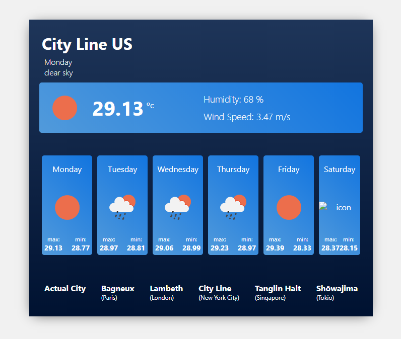

For this project i use react, redux, redux-saga, styled-components and react-spring!

you can see the demo [https://react-weather-app-1.netlify.com](here!)

## Available Scripts

In the project directory, you can run:

### `yarn start`

Runs the app in the development mode. 
Open [http://localhost:3000](http://localhost:3000) to view it in the browser.

The page will reload if you make edits. 
You will also see any lint errors in the console.

